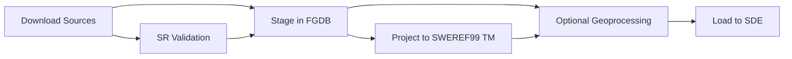

# OP-ETL - Geospatial Data ETL Pipeline

## Overview
OP-ETL is a lightweight ETL pipeline for geospatial data in Esri environments. It downloads open data from multiple sources, stages it in a File Geodatabase (FGDB) for use with ArcPy tools, and loads it into a production ArcSDE geodatabase.

## Features

- **Two-file config** — `config/config.yaml` (settings) + `config/sources.yaml` (sources). Falls back to `config/sources_backup.yaml` or `config/legacy/sources.yaml` if needed.
- **Multiple source types:**
  - HTTP/file downloads (ZIP archives of Shapefiles/FGDBs, GPKG, etc.)
  - ArcGIS REST services with enhanced pagination and OID batching when needed
  - OGC API Features
  - WFS 2.0.0
  - ATOM feeds (enclosure links)
- **Native Esri format staging** — FileGDB staging ensures smooth ArcPy processing
- **Optional geoprocessing** — clip to AOI and optionally reproject to a target WKID
- **Simple SDE load** — truncate-and-load workflow to SQL Server (or other supported RDBMS)
- **Spatial Reference Consistency** — staging defines/projects to SWEREF99 TM (EPSG:3006); processing can reproject to a target WKID (commonly EPSG:3010)
- **Resilient downloads** — robust REST pagination with OID sweep fallback when transfer limits are hit

## Architecture

**OP-ETL uses a streamlined architecture focused on maintainability:**

- **`run.py`**: Main orchestrator handling logging setup, workspace management, and step execution
- **`etl/config.py`**: Two-file configuration system (`config/config.yaml` + `config/sources.yaml`)
- **`etl/stage_files.py`**: Robust staging with format detection and SR consistency
- **`etl/process.py`**: AOI clipping and target reprojection
- **`etl/load_sde.py`**: SDE loading with truncate-and-append strategy

The core pipeline (orchestrator + config + processing + loading) is **864 lines of code**, prioritizing simplicity and maintainability over edge case coverage.

## Basic Workflow



1. **Download**: Fetch data from HTTP, REST, or OGC sources with SR consistency
2. **Validate**: Check coordinate magnitudes and spatial reference integrity
3. **Stage**: Store datasets in FileGDB with proper SR (EPSG:3006)
4. **Process** (optional): Clip to AOI and/or reproject to target WKID (e.g., EPSG:3010)
5. **Load**: Push processed data into ArcSDE

## Spatial Reference Handling

The pipeline enforces consistent spatial reference handling:

- **REST APIs**: Prefer SWEREF99 TM (EPSG:3006) for geometry filters (inSR/outSR); output GeoJSON when supported, else Esri JSON in 3006.
- **OGC APIs**: Default to CRS84 (EPSG:4326); avoid forcing `bbox-crs` unless confirmed supported.
- **Staging**: All feature classes have defined SR; stage to SWEREF99 TM (EPSG:3006).
- **Validation**: Coordinate magnitude checks, no "Unknown" SR allowed

See [Spatial Reference Consistency Documentation](docs/spatial-reference-consistency.md) for details.

## Requirements

- Python 3.11 (ArcGIS Pro environment)
- ArcPy (bundled with ArcGIS Pro)
- PyYAML for config parsing

## Installation

1. Clone the repository:
   ```bash
   git clone https://github.com/1kimnet/op-etl.git
   cd op-etl
   ```

1. Install dependencies:

  ```bash
  pip install -r requirements.txt
  ```

1. Create or edit `config/config.yaml` and `config/sources.yaml`:

   - `config/config.yaml` (settings):
     ```yaml
     workspaces:
       downloads: ./data/downloads
       staging_gdb: ./data/staging.gdb
       sde_conn: ./data/connections/prod.sde

     geoprocess:
       enabled: true
       aoi_boundary: ./data/connections/municipality_boundary.shp
       target_wkid: 3010

     # Optional global bbox filter applied in downloaders
     use_bbox_filter: true
     global_bbox:
       coords: [585826, 6550189, 648593, 6611661]
       crs: 3006   # 3006 | 4326 | "EPSG:3006" | "CRS84"

     # Optional unified downloader
     use_unified_downloader: true

     # Optional cleanup controls
     cleanup_downloads_before_run: false
     cleanup_staging_before_run: false

     # Logging (console + optional file)
     logging:
       level: INFO              # Console level
       file:
         enabled: true
         name: etl.log          # logs/etl.log
         level: DEBUG
     ```

   - `config/sources.yaml` (sources):
     ```yaml
     sources:
       - name: nvdb_vag
         authority: NVDB
         type: rest
         url: https://services.example.com/ArcGIS/rest/services/Vag/MapServer
         raw:
           include: ["*Väg*"]  # Optional layer name patterns
           out_fields: "*"
       - name: sgu_erosion
         authority: SGU
         type: ogc
         url: https://api.sgu.se/oppnadata/stranderosion-kust/ogc/features/v1/
         raw:
           collections: ["aktiv-erosion"]
       - name: open_data_zip
         authority: FM
         type: http
         url: https://www.forsvarsmakten.se/siteassets/geodata/rikstackande-geodata.zip
     ```

   Notes:
   - Accepts type aliases: `http|file`, `rest|rest_api`, `ogc|ogc_api`, `atom|atom_feed`, `wfs`.
   - When `use_bbox_filter` is true, bbox/CRS propagate to the appropriate downloader semantics.

## Usage

Run the pipeline from ArcGIS Pro's Python environment:

```bash
python run.py
```

On Windows `cmd.exe`, using ArcGIS Pro's conda Python explicitly (adjust path/env name as needed):

```cmd
"%LOCALAPPDATA%\ESRI\conda\envs\arcgispro-py3\python.exe" run.py --download --process --load_sde --config config/config.yaml --sources config/sources.yaml
```

Run specific steps:

```cmd
REM Only download
python run.py --download --config config/config.yaml --sources config/sources.yaml

REM Only process
python run.py --process --config config/config.yaml

REM Only load to SDE
python run.py --load_sde --config config/config.yaml
```

> Note: If no flags are provided, all steps will run in sequence.

### Unified Downloader (optional)

You can enable a single, unified downloads pass that dispatches to existing downloaders per source type. Add this to `config/config.yaml`:

```yaml
use_unified_downloader: true
```

It honors `--authority` and `--type` filters. Example:

```cmd
"%LOCALAPPDATA%\ESRI\conda\envs\arcgispro-py3\python.exe" run.py --download --authority RAA --type ogc --config config/config.yaml --sources config/sources.yaml
```

### Logging

- Console shows `INFO` and above by default (configured via `logging.level`).
- Optional file log at `logs/etl.log` when `logging.file.enabled: true`.

To configure logging, edit `config/config.yaml`:

```yaml
logging:
  level: INFO            # Console level
  file:
    enabled: true
    name: etl.log        # logs/etl.log
    level: DEBUG
```

If you see no immediate output, ensure you are using the ArcGIS Pro Python interpreter. ArcPy is lazily imported so logging initializes before heavy modules load.

To avoid emoji/encoding issues in Windows `cmd.exe`, console logs auto‑fallback to ASCII when UTF‑8 isn’t detected. You can force ASCII via:

```cmd
set OP_ETL_ASCII_CONSOLE=1
```

### Geometry Policy (OGC/WFS)

- Explicit geometry types in config are optional. Staging applies robust GeoJSON handling with dominant‑geometry filtering and magnitude checks.
- If a dataset mixes geometries, staging keeps the dominant geometry. Document or pre‑split sources if strict per‑geometry outputs are needed.

## Roadmap

- [ ] Add more geoprocessing tools
- [ ] Add simple logging export to CSV/JSON
- [ ] Expand unit tests for handlers
